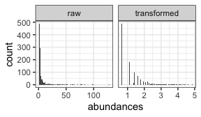
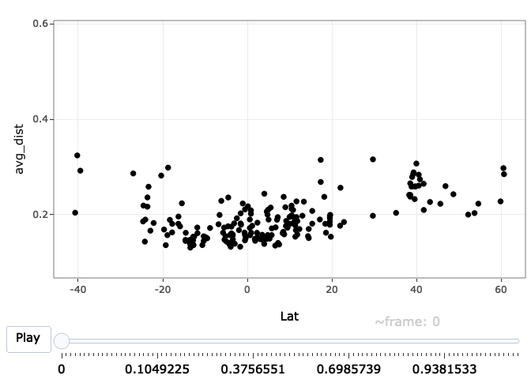
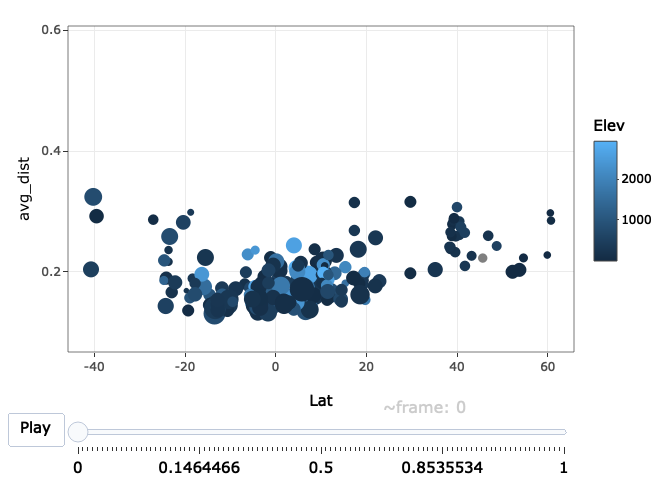
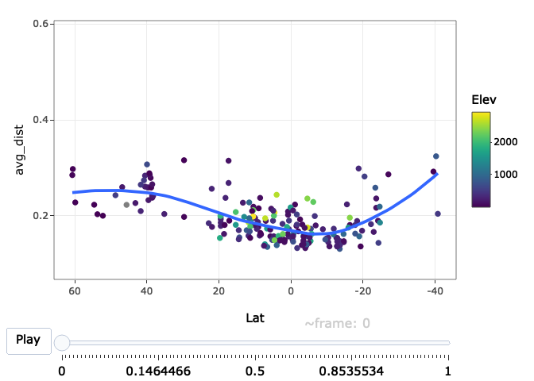
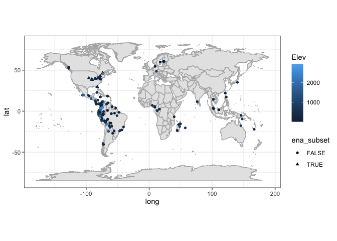
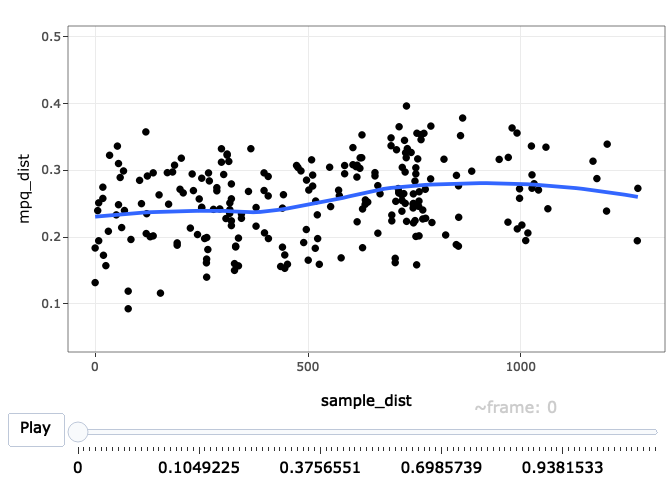
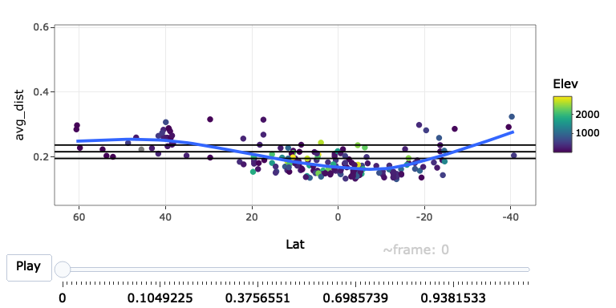
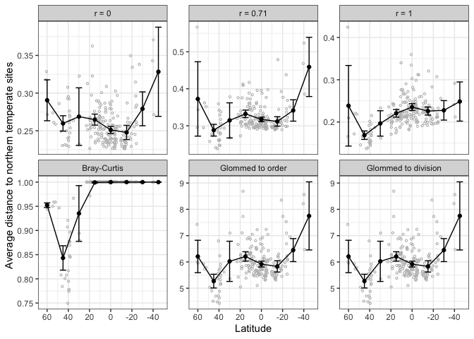

# Introduction

In this vignette, we will show how to use the MPQ distance family to
investigate patterns of beta diversity. In particular, we will analyze
the dataset collected by Alwyn Gentry way back when. Our analysis here
is based on a version of the dataset that David Zeleny posted on his
`anadat-r` repository. A phylogeny was built from the taxonomic
information using `S.PhyloMaker`, and higher-order taxonomic information
was inferred using `taxonlookup`. We did a good deal of data cleaning,
and all of the choices we made can be seen in the script at
`data-raw/gentry.R`.

# Seting up and transformations

We start off by loading the packages we need for this analysis and
loading the `gentry` data, our version of which is available as a
`phyloseq` object. This object includes the counts of each species
observed at each of the sites, phylogenetic and taxonomic information
about the species, and information (latitude, longitude, elevation, and
precipitation) about each of the sites.

    library(ape)
    library(mpqDist)
    library(plotly)
    library(phyloseq)
    library(tidyverse)
    library(viridis)
    library(plotly)
    library(fields)
    library(compositions)
    data(gentry)
    gentry
    #> phyloseq-class experiment-level object
    #> otu_table()   OTU Table:         [ 585 taxa and 197 samples ]
    #> sample_data() Sample Data:       [ 197 samples by 4 sample variables ]
    #> tax_table()   Taxonomy Table:    [ 585 taxa by 4 taxonomic ranks ]
    #> phy_tree()    Phylogenetic Tree: [ 585 tips and 349 internal nodes ]

Here we will apply a started log transform to the counts. We will show
the same analysis below with the raw data or relative abundance data,
but we believe the log transformation is generally beneficial. This is
discussed in more detail in the paper, but there are two primary reasons
for this. First, ratios tend to be more comparable than differences for
abundance data. Second, the counts tend to have a very skewed
distribution, which results in distances involving sites with very high
abundances of a specific species to be very large.

The patterns tend to be the same with the log-transformed vs. raw data,
but the values are more stable and the resulting patterns are easier to
see with the log transformation.

Here we apply a started log transform to the abundances and we show the
distributions of the raw and log-transformed abundances. The transformed
abundances are still skewed, but to a lesser extent than the raw
abundances. The plot below shows the distribution of non-zero
abundances. The fraction of abundances that are 0 is about 99%.

    mean(otu_table(gentry) == 0)
    #> [1] 0.990325
    gentry_log = gentry
    otu_table(gentry_log) = otu_table(clr(1 + otu_table(gentry)), taxa_are_rows = FALSE)
    abundance_df = data.frame(abundances = c(otu_table(gentry), otu_table(gentry_log)),
                              type = rep(c("raw", "transformed"), each = ntaxa(gentry) * nsamples(gentry)))
    ggplot(subset(abundance_df, abundances > 0)) + geom_histogram(aes(x = abundances), bins = 100) +
        facet_wrap(~ type, scales = "free_x")

<figure>

<figcaption aria-hidden="true">Distributions of raw and transformed
abundances</figcaption>
</figure>

# Computing the distances

The `get_mpq_distances` function will compute the full range of MPQr
distances, with r taking values between 0 and 1. Its first argument
should be a matrix (or something that inherits from a matrix, like the
`otu_table` object below). Its second argument should be a phylogenetic
tree of class `phylo`. You can specify a set of values of `r` to compute
if you would like. The default is to take a range of 101 values between
0 and 1 such that the are spaced more closely near 0 and 1 and farther
apart in the middle. There is not a good theoretical reason for this,
but it has worked well in all the examples we have looked at.

    distances = get_mpq_distances(otu_table(gentry_log), phy_tree(gentry_log))

# Making an interactive plot

It is easiest to visualize the family of distances with an animated
plot. This package includes some helper functions that allow the user to
make a couple of different kinds of plots and gives templates so as to
allow the user to make custom versions if the ones included here are not
suitable.

## Built-in plots

### Plot distance to a reference set

The first kind of plot supported is one that shows the distance of each
individual sample to a set of “reference” samples. This sort of plot
would be of use if, for example, you had samples collected from sites
along a river and you wanted to visualize the distance between each site
and a reference site at one end of the river. The function that computes
this is called `plot_dist_to_reference_samples`.

The required arguments are

-   `physeq`: A phyloseq object containing the species abundances at
    each site, a phylogenetic tree describing the species, and a sample
    data matrix with information about the sites.
-   `reference_samples`: A vector containing either the names or the
    indices of the reference sites.
-   `x_variable`: A string giving the name of the variable to plot on
    the x-axis.

As an example, the code below gives us a plot where each point
corresponds to a site, its position on the y-axis corresponds to the
average distance between that site and the sites near the equator, and
its position on the x-axis corresponds to its latitude.

    equatorial_samples = sample_names(gentry_log)[which(sample_data(gentry_log)$Lat >= -10 & sample_data(gentry_log)$Lat <= 10)]
    plot_dist_to_reference_samples(physeq = gentry_log, reference_samples = equatorial_samples,
                                   x_variable = "Lat")

The function also allows for extra aesthetics to be passed to `ggplot`
when it is building the plot. For example, if you want to have the
points colored by Elevation, you would specify `color = "Elevation"` in
`plot_dist_to_reference_samples`. The plot is built using `aes_string`
in `ggplot`, so any aesthetics that `geom_point` understands can be
specified in this way.

    plot_dist_to_reference_samples(physeq = gentry_log, reference_samples = equatorial_samples,
                                   x_variable = "Lat", color = "Elev", size = "Precip")

Finally, if you want to be able to customize the plot more fully, there
is an option for the function to return a ggplot object which can then
be turned into an animated plot by calling the `ggplotly` function on
that object. The advantage of this way of doing things is that the
ggplot object can be modified before being made into an animated plot,
allowing for more customization. For example, if we wanted to change the
color scale, reverse the x axis, and add a loess smoother, we could do
it as follows:

    p = plot_dist_to_reference_samples(physeq = gentry_log, reference_samples = equatorial_samples,
                                       x_variable = "Lat", color = "Elev", return_ggplot = TRUE) +
        stat_smooth(aes(frame = frame), se = FALSE) + 
        scale_x_reverse() +
        scale_color_viridis()
    ggplotly(p)
    #> `geom_smooth()` using method = 'loess' and formula = 'y ~ x'

### Plot all pairs of distances

Another kind of plot that can be useful is one where the difference
between each pair of sites is plotted. The standard here would be to
have one point for each pair of samples, to plot the MPQr distance on
the vertical axis and the geographical distance on the horizontal axis.

To make this sort of plot, you can use the function `plot_all_pairs`.
This function takes the following arguments:

-   `phy`: A phyloseq object, the same as
    `plot_dist_to_reference_samples`.
-   `sample_distances`: Either a matrix or an object of class `dist`
    containing the geographic distances between the samples.
    `plot_all_pairs` assumes that the samples in these objects are in
    the same order as the samples in `phy`.
-   `return_ggplot`: Optional argument to return a ggplot object instead
    of plotting with ggplotly. By default `return_ggplot` is `FALSE`.

Since the number of pairs of distances grows with the square of the
number of sites, it takes a long time to compute all pairs of distances
in this dataset. I will therefore restrict just to the sites in Eastern
North America. The code block below shows the locations of all the sites
in the dataset and has the Eastern North American subset marked.

    sample_data(gentry_log)$ena_subset = sample_data(gentry_log)$Lat > 25 & sample_data(gentry_log)$Long < 0 & sample_data(gentry_log)$Lat < 50
    ggplot(sample_data(gentry_log)) +
        borders("world", colour = "gray70", fill = "gray90") +
        geom_point(aes(x = Long, y = Lat, shape = ena_subset, color = Elev)) + coord_fixed(1.3)

    gentry_log_ena_subset = subset_samples(gentry_log, ena_subset)

Next, we compute the distances between the sites (in this case, using
`rdist.earth`, which computes great circle distances), and use those
distances as input to `plot_all_pairs`. In this case, `plot_all_pairs`
was called with `return_ggplot = TRUE`, which returns a ggplot object
and allows me to add a smoother. Finally, calling `ggplotly(p)` creates
the interactive plot.

    greatcircle_sample_distances = rdist.earth(as.matrix(sample_data(gentry_log_ena_subset)[,c("Long", "Lat")]))
    p = plot_all_pairs(gentry_log_ena_subset, greatcircle_sample_distances, return_ggplot = TRUE)
    p = p + stat_smooth(aes(frame = frame), se = FALSE)
    ggplotly(p)
    #> `geom_smooth()` using method = 'loess' and formula = 'y ~ x'

## Helper functions for custom plots

Detailed description of ggplotly, the package we use for interactive
plots, is available elsewhere, but briefly, to convert a standard
ggplot2 plot to an animated plot with ggplotly, you modify the plotting
data frame so that it has an extra column that specifies the “frame” of
the animation, add that as part of the aesthetic mapping
(e.g. `aes(frame = frame)`) in the ggplot, and then call the `ggplotly`
function on the resulting `ggplot` object.

### The `make_animation_df` function

The `make_animation_df` can help make this sort of data frame. Its first
argument is the output of `get_mpq_distances` (a list with elements
`distances` and `r`), and its second argument is a function that takes a
single distance object and returns a data frame with the variables
needed to make one frame of the animation. Extra arguments can be passed
to the function that makes the data frame if necessary. This function
will be applied to each of the elements of the `distances` slot of the
output of `get_mpq_distances`, the resulting data frames will be bound
together, and a column will be added indicating the frame of the
animation (one frame per value of `r`).

Once this data frame has been created, the user can make an animated
plot by adding `frame = frame` to the aesthetic specification of the
ggplot they would use for a static plot. Calling `ggplotly` on the
resulting ggplot object will make an animated plot.

### Function to create plotting variables

In the code block below, we show an example of creating the data frame
that we need to make an interactive plot. The `make_animation_df`
function in the last line of that block takes as its first argument
`mpq_distances` (the output from the `get_mpq_distances` function). Its
second argument is a function, `get_avg_distances_to_set`. The
`get_avg_distances_to_set` function in turn has three arguments, which
are given as the final three arguments to `make_animation_df` and which
that function passes along to `get_avg_distances_to_set`. So in this
case, inside the `make_animation_df` function, there is a call to
`get_avg_distances_to_set(nmv, equatorial_samples, sample_data(gentry_log))`.

    equatorial_samples = sample_names(gentry_log)[which(sample_data(gentry_log)$Lat >= -10 & sample_data(gentry_log)$Lat <= 10)]
    nmv = get_null_mean_and_variance(gentry_log)
    mpq_distances = get_mpq_distances(otu_table(gentry_log), phy_tree(gentry_log))
    animation_df = make_animation_df(mpq_distances, get_avg_distances_to_set, means_and_vars = nmv, equatorial_samples, sample_data(gentry_log))

Finally, once we have the `animation_df` data frame, we can make an
animated plot. We start off making `p`, a ggplot object, that specifies
the sort of plot we want for each value of `r`. In each `aes`
specification, we add `frame = frame`, which will make the plot scroll
through the different values of `r`. Finally we call `ggplotly` on `p`
to make the interactive plot.

    p = ggplot(aes(x = Lat, y = avg_dist, color = Elev), data = animation_df) +
        geom_point(aes(frame = frame)) +
        geom_hline(aes(yintercept = null_mean, frame = frame)) +
        geom_hline(aes(yintercept = null_mean - 2 * null_sd, frame = frame)) +
        geom_hline(aes(yintercept = null_mean + 2 * null_sd, frame = frame)) +
        stat_smooth(aes(frame = frame), se = FALSE, method = "gam") +
        scale_x_reverse() +
        scale_color_viridis()
    ggplotly(p)
    #> `geom_smooth()` using formula = 'y ~ s(x, bs = "cs")'

### Code to create plots in manuscript

The following code makes a plot that is in the manuscript, comparing
MPQr distances to each other, to Bray-Curtis, and to distances computed
on agglomerated species counts.

    mpq_distances = get_mpq_distances(otu_table(gentry_log), phy_tree(gentry_log))

    mpq_distances$distances[["bray"]] =  distance(gentry, method = "bray")
    mpq_distances$r = c(mpq_distances$r, "bray")
    ##tax_table(gentry) = tax_table(gentry)[,4:1]
    gentry_order_glom = tax_glom(gentry, taxrank = "order")
    gentry_log_order_glom = gentry_order_glom
    otu_table(gentry_log_order_glom) = otu_table(clr(otu_table(gentry_order_glom) + 1), taxa_are_rows = FALSE)
    gentry_group_glom = tax_glom(gentry, taxrank = "group")
    gentry_log_group_glom = gentry_group_glom
    otu_table(gentry_log_group_glom) = otu_table(clr(otu_table(gentry_group_glom) + 1), taxa_are_rows = FALSE)

    mpq_distances$distances[["order_glom"]] = dist(otu_table(gentry_log_order_glom))
    mpq_distances$r = c(mpq_distances$r, "order_glom")
    mpq_distances$distances[["group_glom"]] = dist(otu_table(gentry_log_group_glom))
    mpq_distances$r = c(mpq_distances$r, "group_glom")

    temperate_samples = sample_names(gentry_log)[which(sample_data(gentry_log)$Lat >= 23.5 & sample_data(gentry_log)$Lat <= 66.5)]

    animation_df = make_animation_df(mpq_distances, get_avg_distances_to_set, means_and_vars = NULL, temperate_samples, sample_data(gentry_log))

    mid_r = "0.712889645782536"
    animation_df_sub = subset(animation_df, frame %in% c(mid_r, "0", "1", "bray", "order_glom", "group_glom"))
    animation_df_summarised = animation_df_sub |>
        mutate(latitude_bin = round(Lat / 15) * 15) |>
        group_by(frame, latitude_bin) |> summarise(mean_in_bin = mean(avg_dist), se_in_bin = sd(avg_dist) / sqrt(length(avg_dist)))
    #> `summarise()` has grouped output by 'frame'. You can override using the
    #> `.groups` argument.
    animation_df_sub$frame = factor(animation_df_sub$frame,
                                    levels = c("0", mid_r, "1", "bray", "order_glom", "group_glom"),
                                    ordered = TRUE)
    animation_df_summarised$frame = factor(animation_df_summarised$frame,
                                           levels = c("0", mid_r, "1", "bray", "order_glom", "group_glom"),
                                           ordered = TRUE)

    frame_labels <- c("0" = "r = 0",
                      mid_r = paste("r = ", round(as.numeric(mid_r), digits = 2), sep = ""),
                      "1" = "r = 1",
                      "bray" = "Bray-Curtis",
                      "order_glom" = "Glommed to order",
                      "group_glom" = "Glommed to division")
    names(frame_labels)[2] = mid_r
    #pdf("gentry-latitudinal-distance.pdf", width = 7, height = 5)
    ggplot(data = animation_df_sub) +
        geom_point(aes(x = Lat, y = avg_dist), size = .8, color = 'gray', pch = 1) +
        geom_errorbar(aes(x = latitude_bin,
                          ymin = mean_in_bin - 2 * se_in_bin,
                          ymax = mean_in_bin + 2 * se_in_bin),
                      data = animation_df_summarised,
                      width = 6) +
        geom_point(aes(x = latitude_bin, y= mean_in_bin),
                   data = animation_df_summarised) +
        geom_line(aes(x = latitude_bin, y= mean_in_bin),
                   data = animation_df_summarised) +
        scale_x_reverse(breaks = seq(60, -40, by = -20)) +
        xlab("Latitude") + ylab("Average distance to northern temperate sites")+
        facet_wrap( ~ frame, scales = "free_y", ncol = 3,
                   labeller = labeller(.default = frame_labels))

    #dev.off()
