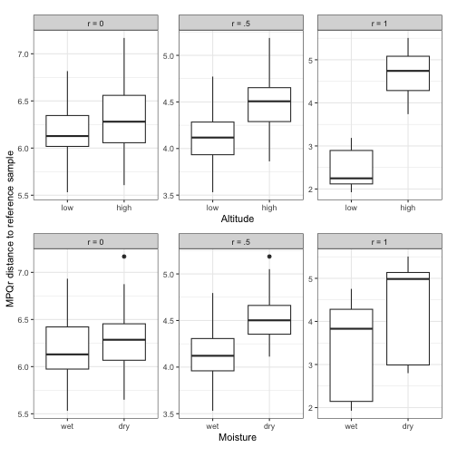
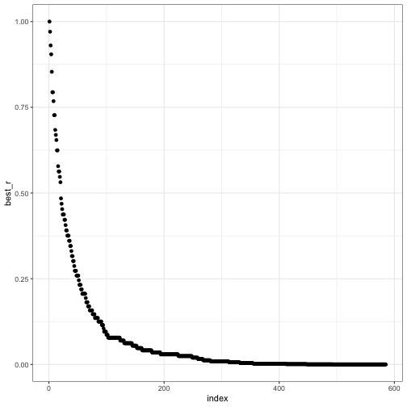
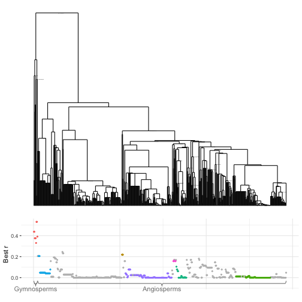

# Setup


``` r
library(ape)
library(mpqDist)
library(plotly)
#> 
#> Attaching package: 'plotly'
#> The following object is masked from 'package:stats':
#> 
#>     filter
#> The following object is masked from 'package:graphics':
#> 
#>     layout
#> The following object is masked from 'package:ggplot2':
#> 
#>     last_plot
library(phyloseq)
library(tidyverse)
#> ── Attaching core tidyverse packages ────────────────────────────────────────── tidyverse 2.0.0 ──
#> ✔ dplyr     1.1.4     ✔ readr     2.1.5
#> ✔ forcats   1.0.0     ✔ stringr   1.5.1
#> ✔ lubridate 1.9.4     ✔ tibble    3.2.1
#> ✔ purrr     1.0.2     ✔ tidyr     1.3.1
#> ── Conflicts ──────────────────────────────────────────────────────────── tidyverse_conflicts() ──
#> ✖ dplyr::filter() masks plotly::filter(), stats::filter()
#> ✖ dplyr::lag()    masks stats::lag()
#> ✖ dplyr::where()  masks ape::where()
#> ℹ Use the conflicted package (<http://conflicted.r-lib.org/>) to force all conflicts to become errors
library(viridis)
#> Loading required package: viridisLite
library(phangorn)
#> 
#> Attaching package: 'phangorn'
#> 
#> The following object is masked from 'package:plotly':
#> 
#>     add_boxplot
library(patchwork)
library(treeDA)
library(ggbrace)
data(gentry)
gentry
#> phyloseq-class experiment-level object
#> otu_table()   OTU Table:         [ 585 taxa and 197 samples ]
#> sample_data() Sample Data:       [ 197 samples by 4 sample variables ]
#> tax_table()   Taxonomy Table:    [ 585 taxa by 4 taxonomic ranks ]
#> phy_tree()    Phylogenetic Tree: [ 585 tips and 349 internal nodes ]
```

# Simulations

We're going to test whether our null means and variances look right.
To do this, we will generate "OTU tables" that are independent normal random variables, with potentially different standard deviations.
We'll use the gentry data as a skeleton (same tree, same number of samples and sites, same standard deviations for the species when we look into changing standard deviations).

``` r
sim_homo = gentry
sim_hetero = gentry
n = nsamples(gentry)
p = ntaxa(gentry)
sds = apply(log(1 + otu_table(gentry)), 2, sd)
sim_homo_matrix = matrix(rnorm(n = n * p), nrow = n, ncol = p)
rownames(sim_homo_matrix) = sample_names(gentry)
colnames(sim_homo_matrix) = taxa_names(gentry)
sim_hetero_matrix = sweep(sim_homo_matrix, MARGIN = 2, STATS = sds, FUN = '*')
otu_table(sim_homo) = otu_table(sim_homo_matrix, taxa_are_rows = FALSE)
otu_table(sim_hetero) = otu_table(sim_hetero_matrix, taxa_are_rows = FALSE)
```

## Homoskedastic case


``` r
base_sample = 1
nmv = get_null_mean_and_variance(sim_homo)
mpq_distances = get_mpq_distances(otu_table(sim_homo), phy_tree(sim_homo))
animation_df = make_animation_df(mpq_distances, get_avg_distances_to_set, means_and_vars = nmv, base_sample, sample_data(sim_homo))
p = ggplot(aes(x = Lat, y = avg_dist, color = Elev), data = animation_df) +
    geom_point(aes(frame = frame)) +
    geom_hline(aes(yintercept = null_mean, frame = frame)) +
    geom_hline(aes(yintercept = null_mean - 2 * null_sd, frame = frame)) +
    geom_hline(aes(yintercept = null_mean + 2 * null_sd, frame = frame)) +
    stat_smooth(aes(frame = frame), se = FALSE) +
    scale_x_reverse() +
    scale_color_viridis()
ggplotly(p)
#> `geom_smooth()` using method = 'loess' and formula = 'y ~ x'
#> Error in loadNamespace(name): there is no package called 'webshot'

p = ggplot(aes(x = Lat, y = avg_dist, color = Elev), data = animation_df) +
    geom_point(aes(frame = frame)) +
    geom_hline(aes(yintercept = median, frame = frame)) +
    geom_hline(aes(yintercept = upper, frame = frame)) +
    geom_hline(aes(yintercept = lower, frame = frame)) +
    stat_smooth(aes(frame = frame), se = FALSE) +
    scale_x_reverse() +
    scale_color_viridis()
ggplotly(p)
#> `geom_smooth()` using method = 'loess' and formula = 'y ~ x'
#> Error in loadNamespace(name): there is no package called 'webshot'
```


## Heteroskedastic case


``` r
base_sample = 1
nmv = get_null_mean_and_variance(sim_hetero)
mpq_distances = get_mpq_distances(otu_table(sim_hetero), phy_tree(sim_hetero))
animation_df = make_animation_df(mpq_distances, get_avg_distances_to_set, means_and_vars = nmv, base_sample, sample_data(sim_hetero))
p = ggplot(aes(x = Lat, y = avg_dist, color = Elev), data = animation_df) +
    geom_point(aes(frame = frame)) +
    geom_hline(aes(yintercept = null_mean, frame = frame)) +
    geom_hline(aes(yintercept = null_mean - 2 * null_sd, frame = frame)) +
    geom_hline(aes(yintercept = null_mean + 2 * null_sd, frame = frame)) +
    stat_smooth(aes(frame = frame), se = FALSE) +
    scale_x_reverse() +
    scale_color_viridis()
ggplotly(p)
#> `geom_smooth()` using method = 'loess' and formula = 'y ~ x'
#> Error in loadNamespace(name): there is no package called 'webshot'


p = ggplot(aes(x = Lat, y = avg_dist, color = Elev), data = animation_df) +
    geom_point(aes(frame = frame)) +
    geom_hline(aes(yintercept = median, frame = frame)) +
    geom_hline(aes(yintercept = upper, frame = frame)) +
    geom_hline(aes(yintercept = lower, frame = frame)) +
    stat_smooth(aes(frame = frame), se = FALSE) +
    scale_x_reverse() +
    scale_color_viridis()
ggplotly(p)
#> `geom_smooth()` using method = 'loess' and formula = 'y ~ x'
#> Error in loadNamespace(name): there is no package called 'webshot'
```

## Non-null distributions


The two-gradient simulation described in the paper:

``` r
make_anticorrelated_noise <- function(n, tr) {
    Q = vcv(tr)
    p = ncol(Q)
    Qeig = eigen(Q)
    D = Qeig$values
    D[1:(p/2)] = 0
    D = D / sum(D)
    D = diag(D)
    E = matrix(rnorm(n * p), nrow = n, ncol = p)
    E %*% sqrt(D) %*% t(Qeig$vectors)
}


set.seed(0)
p = 300
n = 100
tr = rtree(p)
alt = sample(c(-1, 1), n, replace = TRUE)
precip = sample(c(-1, 1), n, replace = TRUE)

phy_big = 1:p %in% Descendants(tr)[[469]]
phy_small_u = 1:p %in% Descendants(tr)[[503]]
phy_small_d = 1:p %in% Descendants(tr)[[529]]
M = .5 * outer(alt, phy_big) + outer(precip, phy_small_u) - outer(precip, phy_small_d)
X = M + rnorm(n = n * p, mean = 10, sd = .75) + p * .25 * make_anticorrelated_noise(n, tr)
colnames(X) = tr$tip.label
two_effect_sim = phyloseq(otu_table(X, taxa_are_rows = FALSE), phy_tree(tr), sample_data(data.frame(alt = alt, precip = precip)))
#nmv = get_null_mean_and_variance(two_effect_sim)
mpq_distances = get_mpq_distances(otu_table(two_effect_sim), phy_tree(two_effect_sim))
animation_df_alt = make_animation_df(mpq_distances, get_avg_distances_to_set, means_and_vars = nmv, base_sample = which.min(alt), sample_data(two_effect_sim))
animation_df_precip = make_animation_df(mpq_distances, get_avg_distances_to_set, means_and_vars = nmv, base_sample = which.min(alt), sample_data(two_effect_sim))
## p1 = ggplot(aes(x = factor(alt), y = avg_dist), data = animation_df_alt) +
##     geom_boxplot(aes(frame = frame))
## ggplotly(p1)

## p3 = ggplot(aes(x = factor(precip), y = avg_dist), data = animation_df_precip) +
##     geom_boxplot(aes(frame = frame))
## ggplotly(p3)
```


``` r
math_labels <- c(
  "0" = "r = 0",
  "0.5" = "r = .5",
  "1" = "r = 1"
)
p1 = ggplot(subset(animation_df_alt, (frame %in% c(0,1) | (frame >= .49 & frame <= .51)) & avg_dist > 0)) +
    geom_boxplot(aes(x = factor(alt), y = avg_dist)) +
    facet_wrap(~ as.factor(frame), scales = "free_y", labeller = labeller(.default = math_labels)) +
    scale_x_discrete(breaks = c(-1, 1), labels = c("low", "high")) +
    xlab("Altitude")
p2 = ggplot(subset(animation_df_precip, (frame %in% c(0,1) | (frame >= .49 & frame <= .51)) & avg_dist > 0)) +
    geom_boxplot(aes(x = factor(precip), y = avg_dist)) +
    facet_wrap(~ as.factor(frame), scales = "free_y", labeller = labeller(.default = math_labels)) +
    scale_x_discrete(breaks = c(-1, 1), labels = c("wet", "dry")) +
    xlab("Moisture")
h_patch <- p1 / p2 & ylab(NULL) & theme(plot.margin = margin(5.5, 5.5, 5.5, 2))
#pdf("two-factor-sim.pdf", width = 6, height = 4)
wrap_elements(h_patch) +
  labs(tag = "MPQr distance to reference sample") +
  theme(
    plot.tag = element_text(size = rel(1), angle = 90),
    plot.tag.position = "left"
  )
```



``` r
#dev.off()
```


## More systematic, and in the tree basis

``` r
convert_to_tree_basis <- function(mu, Qeig) {
    mutilde <- t(Qeig$vectors)%*% mu
}

compare_to_null_tree_basis <- function(mutilde, r, d_noise, Qeig) {
    dr = mpqDist:::get_dr(Qeig, r)
    w = dr * d_noise
    exp_val = t(mutilde * dr) %*% mutilde
    variance = 2 * sum(w^2)
    return(exp_val / sqrt(variance))
}

get_maximizing_r <- function(mutilde, d_noise, Qeig, rvec = mpqDist:::r_transform(0:100/100)) {
    ratios = sapply(rvec, function(r) compare_to_null_tree_basis(mutilde, r, d_noise, Qeig))
    return(rvec[which.max(ratios)])
}
```


``` r
p = ntaxa(gentry)
Q = vcv(phy_tree(gentry))
Qeig = eigen(Q)
best_r_vec = numeric(p)
for(i in 1:p) {
    mutilde = rep(0, p)
    mutilde[i] = 1
    ##d_noise = c(rep(0, p/2), rep(1, p/2)) + .01
    ##d_noise = Qeig$values^(-2) / sum(Qeig$values^(-2))
    d_noise = rep(1, p)
    d_noise = d_noise / sum(d_noise)
    best_r_vec[i] = get_maximizing_r(mutilde, d_noise, Qeig)
}
ggplot(data.frame(best_r = best_r_vec, index = 1:p)) +
    geom_point(aes(x = index, y = best_r))
```




## Make an example with the perfect binary tree


``` r
k = 8
p = 2^k
tr = ape::stree(n = 2^k, type = "balanced")
tr$edge.length = rep(1, nrow(tr$edge))
Q = ape::vcv(tr)
Qeig = eigen(Q)
clades = Descendants(tr)
best_r_vec = numeric(length(clades))
clade_sizes = numeric(length(clades))
for(i in 1:length(clades)) {
    mu = 1:p %in% clades[[i]]
    mu = mu / sqrt(sum(mu^2))
    mutilde = convert_to_tree_basis(mu, Qeig)
    ##d_noise = c(rep(0, p/2), rep(1, p/2)) + .01
    ##d_noise = Qeig$values^(-2) / sum(Qeig$values^(-2))
    d_noise = rep(1, p)
    d_noise = d_noise / sum(d_noise)
    best_r_vec[i] = get_maximizing_r(mutilde, d_noise, Qeig)
    clade_sizes[i] = length(clades[[i]])
}
p_perfect = ggplot(data.frame(best_r = best_r_vec, clade_fraction = clade_sizes / p)) +
    scale_x_log10() +
    xlab("Clade fraction") +
    ylab("Best r") +
    geom_point(aes(x = clade_fraction, y = best_r))
```

## Same as above but with the Gentry tree


``` r
tr = phy_tree(gentry)
p = ntaxa(gentry)
Q = ape::vcv(tr)
Qeig = eigen(Q)
clades = Descendants(tr)
best_r_vec = numeric(length(clades))
clade_sizes = numeric(length(clades))
time_since_divergence_of_mrca = numeric(length(clades))
names = character(length(clades))
tree_height = Q[1,1]
for(i in 1:length(clades)) {
    if(length(clades[[i]]) > 1) {
        mrca = getMRCA(tr, clades[[i]])
        name = ""
    } else {
        mrca = clades[[i]]
        name = tr$tip.label[mrca]
    }
    parent_of_mrca = tr$edge[which(tr$edge[,2] == mrca),1]

    mu = 1:p %in% clades[[i]]
    mu = mu / sqrt(sum(mu^2))
    mutilde = convert_to_tree_basis(mu, Qeig)
    d_noise = rep(1, p)
    d_noise = d_noise / sum(d_noise)
    best_r_vec[i] = get_maximizing_r(mutilde, d_noise, Qeig)
    clade_sizes[i] = length(clades[[i]])
    names[i] = name
    if(length(parent_of_mrca) > 0) {
        time_since_divergence_of_mrca[i] = tree_height - adephylo::distRoot(tr, parent_of_mrca)
    } else{
        time_since_divergence_of_mrca[i] = 0
    }
}
p_gentry =
    ggplot(data.frame(best_r = best_r_vec, clade_fraction = clade_sizes / p)) +
    geom_point(aes(x = clade_fraction, y = best_r)) +
    scale_x_log10() +
    xlab("Clade fraction") +
    ylab("Best r") +
    stat_smooth(aes(x = clade_fraction, y = best_r), method = "gam",  se = FALSE)

size_one_df = subset(data.frame(best_r = best_r_vec,
                                time_since_divergence_of_mrca,
                                clade_sizes,
                                name = names),
                     clade_sizes == 1)
size_one_df$Group = as.vector(tax_table(gentry)[,"group"])
size_one_df$Group[is.na(size_one_df$Group)] = "Angiosperms"
size_one_df$Order = as.vector(tax_table(gentry)[,"order"])
size_one_df |>
    group_by(Order)|>
    summarise(mean_best_r = round(mean(best_r), digits = 2), num_species = length(best_r)) |>
    arrange(desc(mean_best_r)) |>
    head(n = 12) |>
    knitr::kable(format = "latex")
```


\begin{tabular}{l|r|r}
\hline
Order & mean\_best\_r & num\_species\\
\hline
Pinales & 0.42 & 9\\
\hline
Canellales & 0.25 & 1\\
\hline
Laurales & 0.23 & 2\\
\hline
Ranunculales & 0.22 & 3\\
\hline
Berberidopsidales & 0.18 & 1\\
\hline
Cucurbitales & 0.17 & 1\\
\hline
Dilleniales & 0.17 & 2\\
\hline
Rosales & 0.17 & 1\\
\hline
Brassicales & 0.16 & 2\\
\hline
Malpighiales & 0.16 & 5\\
\hline
Arecales & 0.11 & 20\\
\hline
Ericales & 0.10 & 13\\
\hline
\end{tabular}


``` r

##orders_to_label = table(size_one_df$Order) |> sort(decreasing = TRUE) |> names() |> head()
orders_to_label = c("Pinales", "Ranunculales", "Gentianales", "Fagales", "Alismatales", "Sapindales", "Malpighiales")
size_one_df$Order[!(size_one_df$Order %in% orders_to_label)] = NA
leaf_positions = get_leaf_position(phy_tree(gentry), ladderize = FALSE)
size_one_df_with_position = merge(size_one_df, leaf_positions, by.x = "name", by.y = "OTU")
tr_plot = plot_tree(tr, ladderize = FALSE) + coord_flip() +
    scale_x_reverse() +
    theme(panel.border = element_blank())
manual_palette = c(scales::hue_pal()(7), "gray")
names(manual_palette) = c(orders_to_label, "Other")
best_r_plot =
    ggplot(size_one_df_with_position)+
    geom_point(aes(y = best_r, x = otu.pos, color = fct_explicit_na(Order, na_level = "Other")), size = .7) +
    xlab("") +
    theme(axis.ticks.x = element_blank(),
          axis.text.x = element_blank(),
          panel.border = element_blank()) +
    ylab("Best r") +
    scale_color_manual(values = manual_palette, "Order") +
    coord_cartesian(clip = "off")
best_r_plot_with_braces = best_r_plot +
    stat_brace(aes(x = otu.pos, y =0, color = Group, label = Group),width = .05, bending=3, distance = .03, rotate = 180) +
    stat_bracetext(aes(x = otu.pos, y =0, color = Group, label = Group), distance = .08, rotate = 180) +
    theme(legend.position = "none")

best_r_legend = cowplot::get_legend(best_r_plot)
best_r_and_tree_plot = combine_plot_and_tree(best_r_plot_with_braces, tr_plot, tree.height = 3)
```



``` r
p_size_one = ggplot(size_one_df) +
    geom_point(aes(x = time_since_divergence_of_mrca, y = best_r, shape = Group), na.rm = TRUE) +
    scale_shape(na.translate = FALSE) + ylab("Best r") + xlab("Distance to parent node") +
    ggtitle("Individual species in Gentry dataset tree")
```

The code below was for my use writing the paper, it is not evaluated in the compiled version.

``` r
pdf("best-r-by-clade-size.pdf", width = 7, height=2.3)
p_perfect + p_gentry
dev.off()
pdf("best-r-singletons-with-tree.pdf", width = 5.8, height = 3)
best_r_and_tree_plot |> plot()
dev.off()
pdf("best-r-order-legend.pdf", width = 1.2, height = 3)
plot(best_r_legend)
dev.off()
```
